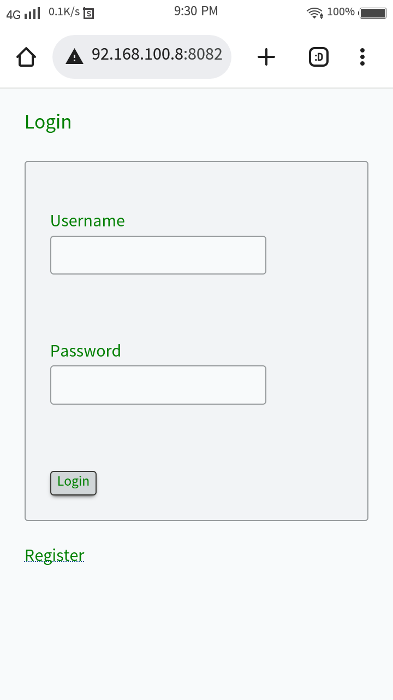

### Note taking app written in Go + HTMX
(go standard templates, Alpine.js, missing.css, GORM)

### Try the Demo
> clone the repo

> cd cmd/demo

> go build

> ./demo

no other dependencies required for the demo since it uses sqlite and in memory caching while web version uses MySQL & Redis.

### Screenshots

